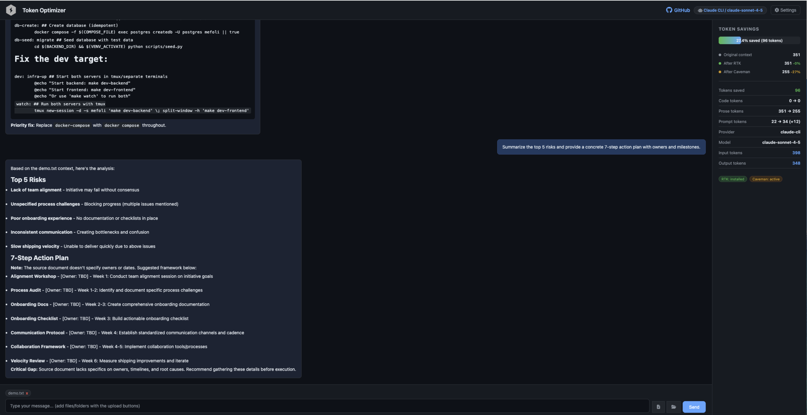
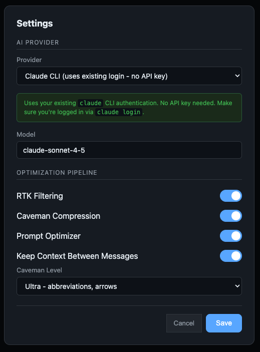

# ctxpress

**High-performance LLM token optimizer — compress context before it hits your wallet.**

```
User Request → Context Collection → RTK Filter → Caveman Compress → Prompt Optimizer → LLM API Call
                                     (-60-90%)      (-25-55%)
```

ctxpress is a self-hosted single-page application that reduces LLM token costs by running your context through an optimization pipeline before sending it to any AI provider. It integrates [RTK](https://github.com/rtk-ai/rtk) for command/file output filtering and [Caveman](https://github.com/JuliusBrussee/caveman)-inspired rule-based compression to strip redundancy — all without making extra LLM calls.

## Features

- **Multi-provider support** — Claude CLI, Claude API, OpenAI/ChatGPT, Google Gemini, or any OpenAI-compatible endpoint (Ollama, LM Studio, Azure)
- **RTK integration** — Shells out to `rtk` CLI for 60-90% token savings on file/directory context
- **Caveman compression** — Pure regex/rule-based text compression (3 levels: lite, full, ultra) with 25-55% savings on prose
- **Prompt Optimizer** — Rule-based prompt cleanup + intent-aware output contract before provider call
- **Code-aware** — Only compresses natural language; code blocks, URLs, file paths, and technical terms are preserved exactly
- **Real-time dashboard** — See context savings + prompt token delta as you chat
- **SSE streaming** — Responses stream in real-time from your chosen LLM
- **Browser uploads** — Attach files or folders directly from the UI (content is sent, no local path typing required)
- **Context persistence control** — Keep attached context between messages or use one-shot context (default)
- **Zero framework frontend** — Single HTML file, no build step, dark theme
- **Security guards** — Skips `.env`, credentials, SSH keys, and other sensitive files automatically

## Quick Start

```bash
git clone https://github.com/rahulchoudhari/ctxpress.git
cd ctxpress
./setup.sh    # Creates venv, installs deps, configures provider + API key
./run.sh      # Starts server at http://127.0.0.1:8765
```

## Screenshots

### Home



### Settings



### Prerequisites

- Python 3.9+
- One of: Anthropic / OpenAI / Google Gemini API key (or a local model via Ollama)
- [RTK](https://github.com/rtk-ai/rtk) (optional, recommended): `brew install rtk`

## Setup

The interactive setup script handles everything:

```bash
./setup.sh
```

It will:
1. Detect your Python installation and create a virtual environment
2. Install all dependencies
3. Ask which AI provider you want to use
4. Prompt for your API key
5. Check for RTK installation
6. Write your `.env` configuration

## How It Works

### Pipeline

```
┌──────────────┐    ┌───────────────────┐    ┌────────────┐    ┌──────────────────┐    ┌──────────┐
│ User Request │───>│ Context Collection │───>│ RTK Filter │───>│ Caveman Compress │───>│ Prompt Opt │───>│ LLM Call │
│              │    │ Read files/dirs    │    │ -60-90%    │    │ -25-55%          │    │ Rule-based │    │ Stream   │
└──────────────┘    └───────────────────┘    └────────────┘    └──────────────────┘    └────────────┘    └──────────┘
```

1. **Context Collection** — Reads files/directories you specify or browser-uploaded file/folder content, classifies them as code/prose, skips sensitive files
2. **RTK Filter** — Runs `rtk read` on each file via subprocess for smart filtering (grouping, deduplication, truncation). Falls back gracefully if RTK isn't installed
3. **Caveman Compress** — Applies rule-based text compression to prose content:
   - **Lite**: Removes filler words, hedging, pleasantries, collapses redundant phrases
   - **Full**: + removes articles, leading phrases, enables fragment-style output
   - **Ultra**: + abbreviations (`database` → `DB`, `authentication` → `auth`) and arrow notation
4. **Prompt Optimizer** — Normalizes user prompt, detects intent, and appends a compact output contract (toggleable)
5. **LLM Call** — Sends optimized context + (optionally) optimized prompt to your chosen provider with SSE streaming

## Concrete Demo (Real Savings)

Use this exact demo to produce visible token reduction in the dashboard.

### 1) Use the included demo file

This repository now includes `demo/demo.txt` with repetitive, filler-heavy prose for compression testing.

You can use it directly, or replace it with your own prose-heavy content.

```text
Hi team, I would just basically like to explain that we are really quite excited about this initiative.
In order to move forward, we would need to first of all make sure that everyone is aligned.
It is important to note that at this point in time we are actually facing a number of process challenges.
With regard to onboarding, we may want to consider creating documentation, and in addition to that,
we might want to consider adding a checklist. Due to the fact that communication is inconsistent,
we are not able to ship quickly. I think we should basically just try to improve collaboration.

Hi team, I would just basically like to explain that we are really quite excited about this initiative.
In order to move forward, we would need to first of all make sure that everyone is aligned.
It is important to note that at this point in time we are actually facing a number of process challenges.
With regard to onboarding, we may want to consider creating documentation, and in addition to that,
we might want to consider adding a checklist. Due to the fact that communication is inconsistent,
we are not able to ship quickly. I think we should basically just try to improve collaboration.

Hi team, I would just basically like to explain that we are really quite excited about this initiative.
In order to move forward, we would need to first of all make sure that everyone is aligned.
It is important to note that at this point in time we are actually facing a number of process challenges.
With regard to onboarding, we may want to consider creating documentation, and in addition to that,
we might want to consider adding a checklist. Due to the fact that communication is inconsistent,
we are not able to ship quickly. I think we should basically just try to improve collaboration.
```

### 2) Configure settings for maximum visible compression

- `RTK Enabled`: ON
- `Caveman Enabled`: ON
- `Caveman Level`: `ultra`
- `Prompt Optimizer`: ON (optional for context savings, useful for prompt shaping)

### 3) Attach `demo/demo.txt` and send this prompt

```text
Summarize the top 5 risks and provide a concrete 7-step action plan with owners and milestones.
```

### 4) What you should see

- `After Caveman` should be clearly lower than `Original context`
- `Tokens saved` should be non-zero (typically noticeable on prose-heavy input)
- If RTK is installed and input is noisy/redundant, `After RTK` may also drop

### Optional: RTK-heavy demo (directory)

To showcase RTK savings, attach a folder containing many repetitive logs/notes/config dumps.
RTK shines most on noisy, duplicated, or overly verbose context sources.

### Cost interpretation

Approximate input cost impact:

$$
	ext{Cost Saved} \approx \frac{\text{Tokens Saved}}{1{,}000{,}000} \times \text{Provider Input Price per 1M tokens}
$$

Example:

- If you save `20,000` tokens per request and your model input price is `$3 / 1M`:

$$
\frac{20{,}000}{1{,}000{,}000} \times 3 = 0.06
$$

You save about `$0.06` per request.

### UI Upload Behavior

- Use the file/folder buttons near the chat box to attach local files/folders.
- Uploaded items are sent as content payloads (not server filesystem paths).
- By default attachments are one-shot and cleared after each message.
- Enable **Keep Context Between Messages** in Settings to persist attachments across turns.

### Compression Example

**Original** (158 chars):
> I would just basically like to explain that the authentication system is really quite simple. In order to authenticate, you need to send a request to the API.

**After Caveman (full)** (115 chars, -27%):
> I would like to explain that authentication system is simple. to authenticate, you need to send request to the API.

**After Caveman (ultra)** (54% savings on technical prose):
> auth config for DB env requires app to store info in repo dir.

Code blocks, inline code, URLs, and file paths are **never modified**.

## Supported Providers

| Provider | SDK | Default Model |
|----------|-----|---------------|
| Claude CLI | `claude` CLI | `claude-sonnet-4-5` |
| Claude | `anthropic` | `claude-sonnet-4-5` |
| OpenAI / ChatGPT | `openai` | `gpt-4o` |
| Google Gemini | `google-genai` | `gemini-2.5-flash` |
| Custom (Ollama, LM Studio, Azure) | `openai` (compatible) | configurable |

Switch providers anytime via the Settings modal in the UI or by editing `.env`.

## Configuration

All settings live in `.env` (created by `setup.sh`):

```env
# Provider: claude-cli | claude | openai | gemini | custom
LLM_PROVIDER=claude-cli

# API Keys
ANTHROPIC_API_KEY=sk-ant-...
OPENAI_API_KEY=sk-...
GEMINI_API_KEY=AI...

# Custom endpoint
CUSTOM_BASE_URL=http://localhost:11434/v1
CUSTOM_MODEL=llama3

# Model overrides
CLAUDE_MODEL=claude-sonnet-4-5
OPENAI_MODEL=gpt-4o
GEMINI_MODEL=gemini-2.5-flash

# Pipeline toggles
RTK_ENABLED=true
RTK_LEVEL=default
CAVEMAN_ENABLED=true
CAVEMAN_LEVEL=full    # lite | full | ultra

# Prompt optimizer
PROMPT_OPT_ENABLED=true

# Attachment behavior in chat UI
KEEP_CONTEXT_BETWEEN_MESSAGES=false
```

## Project Structure

```
ctxpress/
├── setup.sh                  # Interactive setup
├── run.sh                    # Start server
├── requirements.txt
├── .env.example
├── demo/
│   └── demo.txt              # Sample prose-heavy file for savings demo
├── app/
│   ├── Screenshot/
│   │   ├── TokenOptimizerHomePage.png
│   │   └── TokenOptimizerSettings.png
│   ├── main.py               # FastAPI + SSE chat endpoint
│   ├── config.py             # Pydantic settings
│   ├── models.py             # Request/response models
│   ├── static/
│   │   └── index.html        # Full SPA (HTML + CSS + JS)
│   └── pipeline/
│       ├── context.py        # File reading + classification
│       ├── rtk_filter.py     # Async RTK subprocess integration
│       ├── caveman.py        # Rule-based text compression
│       ├── prompt_opt.py     # Rule-based prompt optimization
│       ├── tokencount.py     # tiktoken-based counting
│       └── llm/
│           ├── base.py       # Abstract provider interface
│           ├── claude_cli_provider.py
│           ├── claude_provider.py
│           ├── openai_provider.py
│           ├── gemini_provider.py
│           └── custom_provider.py
```

## API Endpoints

| Method | Path | Description |
|--------|------|-------------|
| `GET` | `/` | Serve the SPA |
| `POST` | `/api/chat` | SSE streaming chat (pipeline + LLM) |
| `GET` | `/api/settings` | Get current config (keys masked) |
| `POST` | `/api/settings` | Update config |
| `GET` | `/api/rtk-status` | Check if RTK is installed |

## Credits

- [RTK](https://github.com/rtk-ai/rtk) — Rust Token Killer, CLI proxy for token-optimized command output
- [Caveman](https://github.com/JuliusBrussee/caveman) — Inspiration for the rule-based compression engine

## License

MIT
